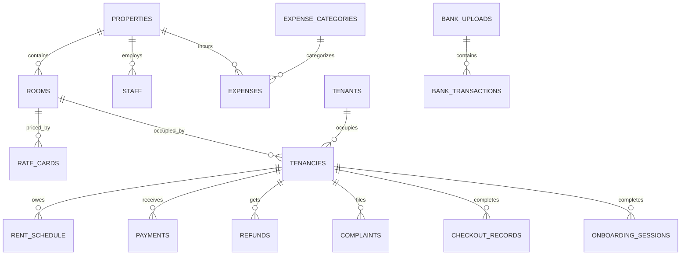

# DATA_MODEL.md — Database Schema Reference

> Single source of truth for database schema. 26 tables across 7 layers.
> DB: Supabase PostgreSQL (asyncpg) | ORM: SQLAlchemy 2.0+ async

---

## 1. Schema Layers

| Layer | Tables | Description |
|-------|--------|-------------|
| L0 — Master | properties, rooms, rate_cards, staff, food_plans, expense_categories, whatsapp_log, conversation_memory, documents, investment_expenses, pg_contacts, learned_rules | Permanent, never delete |
| L1 — Tenant | tenants, tenancies | Re-importable from Excel |
| L2 — Financial | rent_schedule, payments, refunds, expenses | Immutable (use is_void) |
| L3 — Operational | leads, rate_limit_log, vacations, complaints, reminders, pending_actions, onboarding_sessions, checkout_records, activity_log, chat_messages | Wipe-safe |
| L4 — Access | authorized_users | Role registry |
| L5 — AI | conversation_history, pending_learning | Bot state |
| L6 — Bank | bank_uploads, bank_transactions | Statement analytics |

---

## 2. Entity Relationship Diagram

---

## 3. Table Reference

### L0 — MASTER DATA

#### properties
PG buildings (Cozeevo THOR, Cozeevo HULK).

| Column | Type | Nullable | Default | Description |
|--------|------|----------|---------|-------------|
| id | Integer | NO | auto | PK |
| name | String(120) | NO | — | Building name |
| address | Text | YES | NULL | Address |
| owner_name | String(120) | YES | NULL | Owner name |
| phone | String(20) | YES | NULL | Owner phone |
| total_rooms | Integer | YES | 0 | Quick reference count |
| active | Boolean | YES | True | Operational |
| wifi_ssid | String(120) | YES | NULL | Fallback WiFi SSID |
| wifi_password | String(120) | YES | NULL | Fallback WiFi password |
| wifi_floor_map | JSONB | YES | {} | Per-floor WiFi: `{"1": {"ssid": "...", "password": "..."}}` |
| created_at | DateTime | YES | utcnow() | Created |

#### rooms
Physical rooms within a property.

| Column | Type | Nullable | Default | Description |
|--------|------|----------|---------|-------------|
| id | Integer | NO | auto | PK |
| property_id | Integer | NO | — | FK properties |
| room_number | String(20) | NO | — | "G01", "101", "508/509" |
| floor | Integer | YES | NULL | 0=ground, 1=first... |
| room_type | Enum(RoomType) | NO | — | single/double/triple |
| max_occupancy | Integer | YES | 1 | Bed capacity (1/2/3) |
| has_ac | Boolean | YES | False | AC available |
| has_attached_bath | Boolean | YES | False | Attached bathroom |
| is_staff_room | Boolean | YES | False | Excluded from revenue |
| is_charged | Boolean | YES | True | False = free room |
| active | Boolean | YES | True | Operational |

**Unique:** (property_id, room_number)
**Rule:** Premium is NOT a room attribute -- it's tenancy.sharing_type

#### rate_cards
Historical rent pricing per room.

| Column | Type | Nullable | Default | Description |
|--------|------|----------|---------|-------------|
| id | Integer | NO | auto | PK |
| room_id | Integer | NO | — | FK rooms |
| effective_from | Date | NO | — | Rate start date |
| effective_to | Date | YES | NULL | NULL = currently active |
| monthly_rent | Numeric(12,2) | YES | NULL | Monthly rent |
| daily_rate | Numeric(10,2) | YES | NULL | Per-night rate |

#### staff
PG employees.

| Column | Type | Nullable | Default | Description |
|--------|------|----------|---------|-------------|
| id | Integer | NO | auto | PK |
| property_id | Integer | YES | NULL | FK properties |
| name | String(120) | NO | — | Name |
| phone | String(20) | YES | NULL | Phone |
| role | String(60) | YES | NULL | Manager/Housekeeping/Security |
| active | Boolean | YES | True | Currently employed |

#### expense_categories
Expense taxonomy (supports parent/child via parent_id).

| Column | Type | Nullable | Default | Description |
|--------|------|----------|---------|-------------|
| id | Integer | NO | auto | PK |
| name | String(80) | NO | UNIQUE | Category name |
| parent_id | Integer | YES | NULL | FK self (sub-categories) |
| active | Boolean | YES | True | In use |

---

### L1 — TENANT MASTER

#### tenants
Person records. Phone is WhatsApp identity key.

| Column | Type | Nullable | Default | Description |
|--------|------|----------|---------|-------------|
| id | Integer | NO | auto | PK |
| name | String(120) | NO | — | Full name |
| gender | String(10) | YES | NULL | male/female/other |
| phone | String(20) | NO | UNIQUE | WhatsApp phone (10-digit) |
| date_of_birth | Date | YES | NULL | DOB |
| permanent_address | Text | YES | NULL | Home address |
| email | String(120) | YES | NULL | Email |
| occupation | String(120) | YES | NULL | Job/student |
| emergency_contact_name | String(120) | YES | NULL | Emergency contact |
| emergency_contact_phone | String(20) | YES | NULL | Emergency phone |
| id_proof_type | String(40) | YES | NULL | Aadhar/Passport/DL/PAN |
| id_proof_number | String(60) | YES | NULL | ID number |
| created_at | DateTime | YES | utcnow() | Created |

#### tenancies
Tenant-room-stay assignment. Links tenant + room + financial terms.

| Column | Type | Nullable | Default | Description |
|--------|------|----------|---------|-------------|
| id | Integer | NO | auto | PK |
| tenant_id | Integer | NO | — | FK tenants |
| room_id | Integer | NO | — | FK rooms |
| stay_type | Enum(StayType) | NO | monthly | monthly/daily |
| sharing_type | Enum(SharingType) | YES | NULL | single/double/triple/**premium** |
| status | Enum(TenancyStatus) | NO | active | active/exited/cancelled/no_show |
| checkin_date | Date | NO | — | Move-in date |
| checkout_date | Date | YES | NULL | Actual exit date |
| expected_checkout | Date | YES | NULL | Planned exit date |
| notice_date | Date | YES | NULL | When notice was given |
| booking_amount | Numeric(12,2) | YES | 0 | Advance booking |
| security_deposit | Numeric(12,2) | YES | 0 | Security deposit |
| maintenance_fee | Numeric(10,2) | YES | 0 | Maintenance charge |
| agreed_rent | Numeric(12,2) | YES | 0 | Current rent |
| food_plan_id | Integer | YES | NULL | FK food_plans |
| assigned_staff_id | Integer | YES | NULL | FK staff |
| lock_in_months | Integer | YES | 0 | Minimum stay |
| notes | Text | YES | NULL | Special agreements |
| created_at | DateTime | YES | utcnow() | Created |

**Premium logic:** sharing_type='premium' → 1 person occupies entire room → counts as max_occupancy beds

---

### L2 — FINANCIAL (Immutable)

#### rent_schedule
What a tenant OWES each month. One row per tenancy per calendar month.

| Column | Type | Nullable | Default | Description |
|--------|------|----------|---------|-------------|
| id | Integer | NO | auto | PK |
| tenancy_id | Integer | NO | — | FK tenancies |
| period_month | Date | NO | — | Always 1st of month (2026-03-01) |
| rent_due | Numeric(12,2) | YES | 0 | Rent amount due |
| maintenance_due | Numeric(10,2) | YES | 0 | Maintenance charge |
| adjustment | Numeric(12,2) | YES | 0 | +surcharge / -discount |
| adjustment_note | String(200) | YES | NULL | Reason |
| status | Enum(RentStatus) | YES | pending | pending/paid/partial/waived/na/exit |
| due_date | Date | YES | NULL | Usually 1st of month |

**Unique:** (tenancy_id, period_month)
**Formula:** effective_due = rent_due + maintenance_due + adjustment

#### payments
Actual money RECEIVED. **Never hard-delete -- use is_void=True.**

| Column | Type | Nullable | Default | Description |
|--------|------|----------|---------|-------------|
| id | Integer | NO | auto | PK |
| tenancy_id | Integer | NO | — | FK tenancies |
| amount | Numeric(12,2) | NO | — | Payment amount |
| payment_date | Date | NO | — | Date received |
| payment_mode | Enum(PaymentMode) | NO | — | cash/upi/bank_transfer/cheque |
| upi_reference | String(100) | YES | NULL | UPI ref (dedup) |
| for_type | Enum(PaymentFor) | NO | rent | rent/deposit/booking/maintenance/other |
| period_month | Date | YES | NULL | Which month (NULL for deposit) |
| received_by_staff_id | Integer | YES | NULL | FK staff |
| is_void | Boolean | YES | False | Soft delete |
| notes | Text | YES | NULL | Remarks |
| created_at | DateTime | YES | utcnow() | Created |

#### refunds
Deposit refunds and overpayment returns.

| Column | Type | Nullable | Default | Description |
|--------|------|----------|---------|-------------|
| id | Integer | NO | auto | PK |
| tenancy_id | Integer | NO | — | FK tenancies |
| amount | Numeric(12,2) | NO | — | Refund amount |
| refund_date | Date | YES | NULL | NULL = pending |
| payment_mode | Enum(PaymentMode) | YES | NULL | How refunded |
| reason | Text | YES | NULL | Reason |
| status | Enum(RefundStatus) | YES | pending | pending/processed/cancelled |

#### expenses
Operational expenses. **Never hard-delete -- use is_void=True.**

| Column | Type | Nullable | Default | Description |
|--------|------|----------|---------|-------------|
| id | Integer | NO | auto | PK |
| property_id | Integer | NO | — | FK properties |
| category_id | Integer | YES | NULL | FK expense_categories |
| amount | Numeric(12,2) | NO | — | Amount |
| expense_date | Date | NO | — | Date incurred |
| payment_mode | Enum(PaymentMode) | YES | NULL | How paid |
| vendor_name | String(120) | YES | NULL | Who was paid |
| description | Text | YES | NULL | What for |
| is_void | Boolean | YES | False | Soft delete |

---

### L3 — OPERATIONAL

#### complaints

| Column | Type | Nullable | Default |
|--------|------|----------|---------|
| id | Integer | NO | auto |
| tenancy_id | Integer | NO | FK |
| category | Enum | NO | plumbing/electricity/wifi/food/furniture/other |
| description | Text | NO | — |
| status | Enum | YES | open → in_progress → resolved → closed |
| created_at | DateTime | YES | utcnow() |
| resolved_at | DateTime | YES | NULL |

#### pending_actions
Multi-step conversation state machine.

| Column | Type | Nullable | Default |
|--------|------|----------|---------|
| id | Integer | NO | auto |
| phone | String(40) | NO | — |
| intent | String(40) | NO | — |
| action_data | Text(JSON) | YES | NULL |
| choices | Text(JSON) | YES | NULL |
| expires_at | DateTime | NO | +30min |
| resolved | Boolean | YES | False |

#### activity_log

| Column | Type | Nullable | Default |
|--------|------|----------|---------|
| id | Integer | NO | auto |
| logged_by | String(30) | NO | — |
| log_type | Enum | YES | delivery/purchase/maintenance/utility/supply/staff/visitor/note |
| room | String(20) | YES | NULL |
| description | Text | NO | — |
| amount | Numeric(12,2) | YES | NULL |
| dedup_hash | String(64) | YES | UNIQUE |

#### chat_messages
Full chat archive. Never deleted.

| Column | Type | Nullable | Default |
|--------|------|----------|---------|
| id | Integer | NO | auto |
| phone | String(30) | NO | — |
| direction | String(10) | NO | inbound/outbound |
| message | Text | NO | — |
| intent | String(60) | YES | NULL |
| role | String(20) | YES | NULL |
| created_at | DateTime | YES | utcnow() |

---

### L4 — ACCESS CONTROL

#### authorized_users

| Column | Type | Nullable | Default |
|--------|------|----------|---------|
| id | Integer | NO | auto |
| phone | String(20) | NO | UNIQUE |
| name | String(120) | YES | NULL |
| role | Enum | NO | admin/power_user/key_user/receptionist/end_user |
| property_id | Integer | YES | NULL |
| active | Boolean | YES | True |

**Role hierarchy:** admin > power_user > key_user > receptionist > end_user

---

### L6 — BANK ANALYTICS

#### bank_uploads

| Column | Type | Nullable | Default |
|--------|------|----------|---------|
| id | Integer | NO | auto |
| phone | String(20) | NO | — |
| file_path | String(500) | YES | NULL |
| row_count | Integer | YES | 0 |
| new_count | Integer | YES | 0 |
| from_date | Date | YES | NULL |
| to_date | Date | YES | NULL |
| status | String(20) | YES | processed |

#### bank_transactions

| Column | Type | Nullable | Default |
|--------|------|----------|---------|
| id | Integer | NO | auto |
| upload_id | Integer | YES | FK bank_uploads |
| txn_date | Date | NO | — |
| description | Text | YES | "" |
| amount | Numeric(12,2) | NO | — |
| txn_type | String(10) | YES | expense (income/expense) |
| category | String(80) | YES | Other Expenses |
| sub_category | String(120) | YES | "" |
| unique_hash | String(64) | YES | UNIQUE (SHA-256 dedup) |

---

## 4. Enums

### TenancyStatus
| Value | Description |
|-------|-------------|
| active | Currently in room |
| exited | Has left (checkout_date set) |
| cancelled | Never started |
| no_show | Never arrived after booking |

### SharingType
| Value | Description |
|-------|-------------|
| single | 1 person in single room |
| double | Regular sharing in double room |
| triple | Regular sharing in triple room |
| **premium** | **1 person occupies entire multi-bed room at premium rate** |

### RentStatus
| Value | Description |
|-------|-------------|
| pending | Full amount unpaid |
| paid | Fully paid |
| partial | Partially paid |
| waived | Forgiven |
| na | Tenant not present |
| exit | Exited mid-month (prorated) |

### PaymentMode
cash | upi | bank_transfer | cheque

### PaymentFor
rent | deposit | booking | maintenance | food | penalty | other

### RefundStatus
pending | processed | cancelled

### ComplaintCategory
plumbing | electricity | wifi | food | furniture | other

### ActivityLogType
delivery | purchase | maintenance | utility | supply | staff | visitor | payment | complaint | checkout | note

---

## 5. Critical Data Rules

1. **NEVER hard-delete** payments, expenses, refunds -- use `is_void = True`
2. **period_month** is ALWAYS 1st of month: `2026-03-01` not `2026-03-15`
3. **Dues scoping**: status=active AND checkin_date < month_start AND period_month = target
4. **No-show count**: ALL no_shows, no checkin_date filter
5. **Premium**: tenancy attribute, not room -- 1 person = max_occupancy beds
6. **Staff rooms**: is_staff_room=True excluded from all revenue/occupancy calculations
7. **Dedup**: bank_transactions, investment_expenses, pg_contacts use SHA-256 unique_hash
8. **Soft delete pattern**: `WHERE is_void = False` on all financial queries
